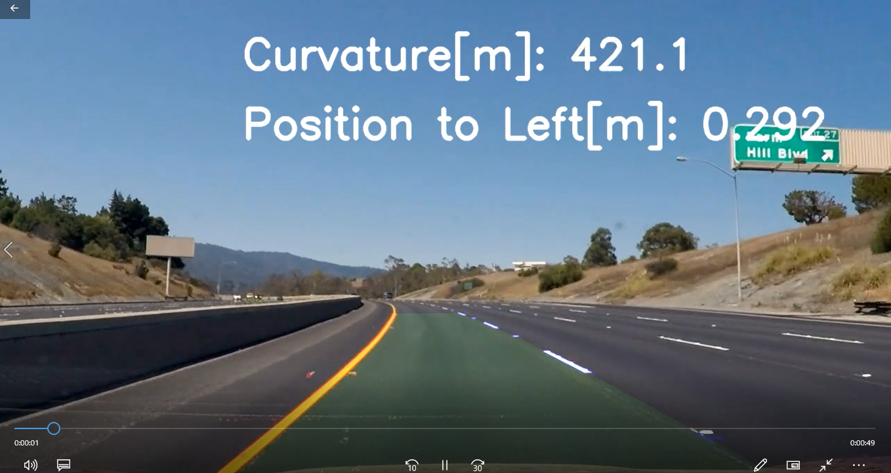

# **Advanced Lane Finding** 

Overview
---

When we drive, we use our eyes to decide where to go.  The lines on the road that show us where the lanes are act as our constant reference for where to steer the vehicle.  Naturally, one of the first things we would like to do in developing a self-driving car is to automatically detect lane lines using an algorithm.

In this project I detected lane lines in images using Python and OpenCV.  OpenCV means "Open-Source Computer Vision", which is a package that has many useful tools for analyzing images.  

To complete the project, two files were submitted: a file containing project code and a file containing a brief write up explaining my solution.
The code file is called "P2.ipynb" and the writeup template is "Writeup_of_Lesson8.pdf".

The Project Rubrics
---

1. Writeup / README  
(1)Provide a Writeup / README that includes all the rubric points and how you addressed each one. You can submit your writeup as markdown or pdf.  
 [Ipython notebook with code](https://github.com/kkumazaki/Self-Drivig-Car_Project2_Advanced-Lane-Finding/tree/master/P2.ipynb)  
 [A writeup report](https://github.com/kkumazaki/Self-Drivig-Car_Project2_Advanced-Lane-Finding/tree/master/Writeup_of_Lesson8.pdf)
 
2. Camera Calibration  
(1)Briefly state how you computed the camera matrix and distortion coefficients. Provide an example of a distortion corrected calibration image.    
 [Pictures of Calibration](https://github.com/kkumazaki/Self-Drivig-Car_Project2_Advanced-Lane-Finding/tree/master/output_images/1_Calibration)  

3. Pipeline (test images)  
(1) Provide an example of a distortion-corrected image.  
 [Distortion corrected images](https://github.com/kkumazaki/Self-Drivig-Car_Project2_Advanced-Lane-Finding/tree/master/output_images/2_Undistortion\Camera)  
(2) Describe how (and identify where in your code) you used color transforms, gradients or other methods to create a thresholded binary image. Provide an example of a binary image result.  
 [Color transform and Gradient threshold](https://github.com/kkumazaki/Self-Drivig-Car_Project2_Advanced-Lane-Finding/tree/master/output_images/3_Thresholded)  
 (3) Describe how (and identify where in your code) you performed a perspective transform and provide an example of a transformed image.   
 [Perspective transform](https://github.com/kkumazaki/Self-Drivig-Car_Project2_Advanced-Lane-Finding/tree/master/output_images/4_Transform)  
  (4) Describe how (and identify where in your code) you identified lane-line pixels and fit their positions with a polynomial?   
 [Finding lane lines](https://github.com/kkumazaki/Self-Drivig-Car_Project2_Advanced-Lane-Finding/tree/master/output_images/5_Finding)  
   (5) Describe how (and identify where in your code) you calculated the radius of curvature of the lane and the position of the vehicle with respect to center.   
 [Calculate curvature and position](https://github.com/kkumazaki/Self-Drivig-Car_Project2_Advanced-Lane-Finding/tree/master/output_images/6_Result)  
   (6) Provide an example image of your result plotted back down onto the road such that the lane area is identified clearly.  
 [Resulting image](https://github.com/kkumazaki/Self-Drivig-Car_Project2_Advanced-Lane-Finding/tree/master/output_images/6_Result)  

4. Pipeline (video)  
(1) Provide a link to your final video output. Your pipeline should perform reasonably well on the entire project video (wobbly lines are ok but no catastrophic failures that would cause the car to drive off the road!)  
 [Video: project_video_output.mp4](https://github.com/kkumazaki/Self-Drivig-Car_Project2_Advanced-Lane-Finding/tree/master/test_videos_output)  

5. Discussion  
(1)Briefly discuss any problems / issues you faced in your implementation of this project. Where will your pipeline likely fail? What could you do to make it more robust?  
[Video: challenge_video_output.mp4, harder_challenge_video_output.mp4](https://github.com/kkumazaki/Self-Drivig-Car_Project2_Advanced-Lane-Finding/tree/master/test_videos_output)  
  
   *: Please refer the writeup report for details!

